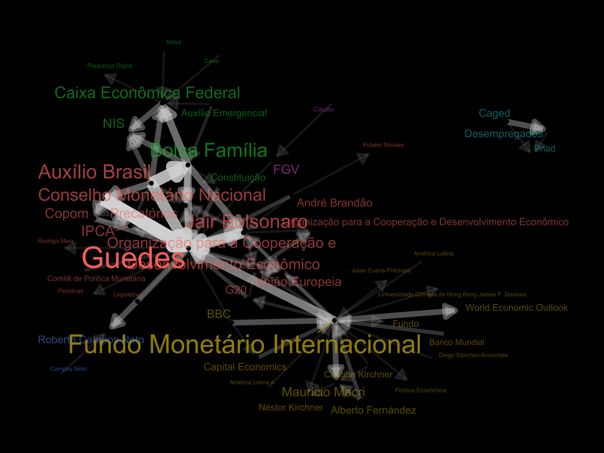

# Comissão Parlamentar de Inquérito - Pandemia

O grafo abaixo foi construído a partir dos três scripts presentes no repositório:

1. `inport_data_and_prepare.R`
2. `ner.R`
3. `build_graph.R`

O primeiro script (`01_inport_data_and_prepare.R`) executa a tarefa de carregar um banco de dados de aproximadamente 27GB de tweets coletados e fornecidos gentilmente pelo [Janderson Toth](https://twitter.com/trifenol)! Para quem não o conheçe recomendo fortemente [segui-lo no linkedin](https://br.linkedin.com/in/trifenol) pois tem compartilhado uma série de posts com insights obtidos destes dados!

O segundo script `02_ner.R` executa um modelo de NLP (Natural Language Processing) conhecido como NER (Named Entity Recognition) que é capaz de detectar uma [variedade enorme de entidades nos textos](https://spacy.io/models/pt#pt_core_news_sm). Precisei rodar esta rotina em um computador mais 'parrudo' e demorou cerca de 20h para completar. Após rodar o modelo, apenas as entidades ORG (organização) e PER (pessoa) foram retidas e um arquivo de cache foi salvo (`filtered_entities.rds`). 

⚠️ Atenção: Os dois primeiros scripts não poderão ser executados sem a base de dados `cpidapandemia.sqlite` fornecida preveamente! Infelizmente não tenho mais acesso a ela portanto caso queira reproduzir o grafo abaixo utilize apenas o script `03_build_graph.R`

O terceiro script `03_build_graph.R` termina o trabalho. Ele carrega o cache salvo do script `02_ner.R`, prepara os objetos para o grafo e faz o desenho.

Espero que gostem!

